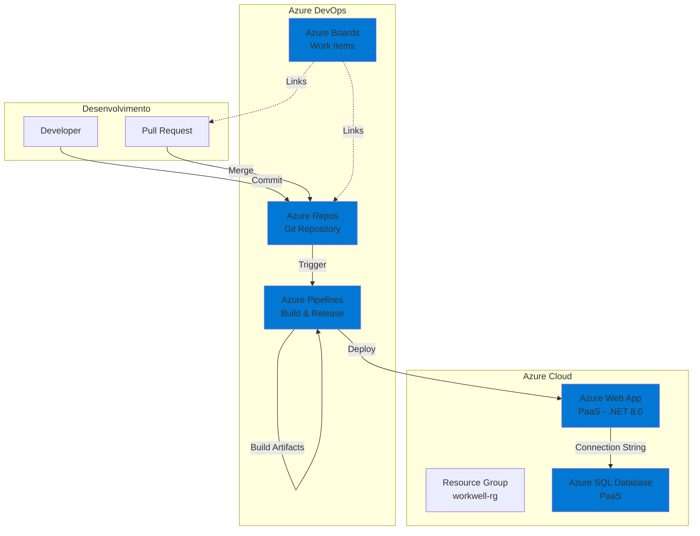

# WorkWell API - Plataforma de Bem-Estar Corporativo

## 👤 Integrantes

- **Enzo Giuseppe Marsola** – RM: 556310, Turma: 2TDSPK  
- **Rafael de Souza Pinto** – RM: 555130, Turma: 2TDSPY  
- **Luiz Paulo F. Fernandes** – RM: 555497, Turma: 2TDSPF

## 📋 Sobre o Projeto

WorkWell é uma API .NET 8.0 desenvolvida para gerenciar o bem-estar emocional e psicológico de funcionários em empresas. A plataforma oferece funcionalidades como avaliações emocionais, consultas psicológicas, atividades de bem-estar, enquetes, denúncias anônimas e indicadores de saúde mental organizacional.

## 🏗️ Arquitetura

### Diagrama Macro da Arquitetura



#### Observações sobre o Diagrama
Este diagrama reflete de forma fiel o deploy implementado:
- Azure Boards são usados para rastrear e vincular Work Items aos pushes/commits/PRs.
- O código fica no Azure Repos e a branch principal é protegida.
- Azure Pipelines Build é acionada automaticamente via trigger após merge via PR na branch principal.
- Azure Pipelines Release é acionada automaticamente após Build, realizando o deploy no Azure Web App PaaS.
- O Web App se conecta ao Azure SQL Database, ambos criados via script e mantidos dentro do mesmo Resource Group.

A automação entre Boards ⇄ Repos ⇄ Pipelines está representada tanto pelo trigger (após merge) quanto pelos links e uso de Work Items. O fluxo CI/CD está 100% automatizado — não exige intervenção manual para build ou release.

### Fluxo de CI/CD

1. **Desenvolvimento**: Developer faz commit e cria Pull Request vinculada a um Work Item do Azure Boards.
2. **Revisão**: A branch principal (main) exige revisor obrigatório, vinculação de Work Item e merge via PR.
3. **Build Pipeline** (`azure-pipeline-build.yml`, raiz do projeto): 
   - Executa após merge do PR, nunca por push direto.
   - Roda restore, build, testes (XUnit) e publica artefatos e resultados de testes.
4. **Release Pipeline** (`azure-pipeline-release.yml`, raiz do projeto):
   - Executa automaticamente após Build gerar artefato.
   - Realiza deploy no Azure Web App PaaS.
   - Publica configurações de ambiente e connection strings.
   - Aplica EF Core migrations, se necessário.

O deploy realizado segue rigorosamente este fluxo, e todos os recursos (Resource Group, DB, WebApp) são provisionados e utilizados conforme o diagrama acima.

## 🚀 Tecnologias

- **.NET 8.0** - Framework principal
- **Entity Framework Core** - ORM
- **Azure SQL Database** - Banco de dados (PaaS)
- **Azure Web App** - Hospedagem (PaaS)
- **XUnit** - Framework de testes
- **Swagger/OpenAPI** - Documentação da API
- **Azure DevOps** - CI/CD e gerenciamento

## 📦 Estrutura do Projeto

```
WorkWell.sln
├── WorkWell.API/                # Camada de apresentação (Controllers, Middleware)
├── WorkWell.Application/        # Camada de aplicação (Services, DTOs)
├── WorkWell.Domain/             # Camada de domínio (Entities, Interfaces)
├── WorkWell.Infrastructure/     # Camada de infraestrutura (Repositories, DbContext)
├── WorkWell.Tests/              # Testes unitários (XUnit)
├── scripts/                     # Scripts de infraestrutura e banco
│   ├── script-infra-deploy.sh
│   └── script-bd.sql
├── azure-pipeline-build.yml     # Pipeline de Build (raiz)
├── azure-pipeline-release.yml   # Pipeline de Release (raiz)
```

> **Observação**:  
> O projeto não faz uso de containerização Docker no deploy em nuvem, optando totalmente por recursos PaaS (App Service + Azure SQL).

## 🔐 Autenticação

A API utiliza **API Keys** para autenticação. Cada perfil possui uma chave específica:

- **Admin**: Acesso total ao sistema
- **RH**: Gestão de funcionários e setores
- **Psicologo**: Acesso a consultas e avaliações
- **Funcionario**: Acesso limitado ao próprio perfil

### Headers Obrigatórios

```
X-API-Key: <sua-api-key>
```

## 📚 Endpoints CRUD - Exemplos JSON

### 1. Empresa (EmpresaController)

#### CREATE - POST `/api/v1/Empresa`

**Request:**
```json
{
  "nome": "Futuro do Trabalho Ltda",
  "emailAdmin": "admin@futurework.com",
  "senhaAdmin": "admin123",
  "tokenAcesso": "token-ftw-001",
  "logoUrl": "https://futurework.com/logo.png",
  "corPrimaria": "#1F77B4",
  "corSecundaria": "#FFB800",
  "missao": "Transformar o bem-estar no ambiente de trabalho.",
  "politicaBemEstar": "Aqui o respeito e o cuidado são prioridades!"
}
```
**Response (201 Created):**
```json
{
  "id": 1,
  "nome": "Futuro do Trabalho Ltda",
  "emailAdmin": "admin@futurework.com",
  "senhaAdmin": "admin123",
  "tokenAcesso": "token-ftw-001",
  "logoUrl": "https://futurework.com/logo.png",
  "corPrimaria": "#1F77B4",
  "corSecundaria": "#FFB800",
  "missao": "Transformar o bem-estar no ambiente de trabalho.",
  "politicaBemEstar": "Aqui o respeito e o cuidado são prioridades!"
}
```

#### READ - GET `/api/v1/Empresa/{id}`

**Response (200 OK):**
```json
{
  "id": 1,
  "nome": "Futuro do Trabalho Ltda",
  "emailAdmin": "admin@futurework.com",
  "senhaAdmin": "admin123",
  "tokenAcesso": "token-ftw-001",
  "logoUrl": "https://futurework.com/logo.png",
  "corPrimaria": "#1F77B4",
  "corSecundaria": "#FFB800",
  "missao": "Transformar o bem-estar no ambiente de trabalho.",
  "politicaBemEstar": "Aqui o respeito e o cuidado são prioridades!"
}
```

#### READ ALL (Paged) - GET `/api/v1/Empresa?page=1&pageSize=10`

**Response (200 OK):**
```json
{
  "page": 1,
  "pageSize": 10,
  "totalCount": 1,
  "totalPages": 1,
  "data": [
    {
      "id": 1,
      "nome": "Futuro do Trabalho Ltda",
      "emailAdmin": "admin@futurework.com",
      "senhaAdmin": "admin123",
      "tokenAcesso": "token-ftw-001",
      "logoUrl": "https://futurework.com/logo.png",
      "corPrimaria": "#1F77B4",
      "corSecundaria": "#FFB800",
      "missao": "Transformar o bem-estar no ambiente de trabalho.",
      "politicaBemEstar": "Aqui o respeito e o cuidado são prioridades!"
    }
  ],
  "links": {
    "self": "/api/v1/Empresa?page=1&pageSize=10",
    "first": "/api/v1/Empresa?page=1&pageSize=10",
    "last": "/api/v1/Empresa?page=1&pageSize=10"
  }
}
```

#### UPDATE - PUT `/api/v1/Empresa/{id}`

**Request:**
```json
{
  "id": 1,
  "nome": "Futuro do Trabalho Ltda - Atualizado",
  "emailAdmin": "admin@futurework.com",
  "senhaAdmin": "admin123",
  "tokenAcesso": "token-ftw-001",
  "logoUrl": "https://futurework.com/logo-v2.png",
  "corPrimaria": "#1F77B4",
  "corSecundaria": "#FFB800",
  "missao": "Transformar o bem-estar no ambiente de trabalho - Missão Atualizada.",
  "politicaBemEstar": "Aqui o respeito e o cuidado são prioridades!"
}
```
**Response (204 No Content)**

#### DELETE - DELETE `/api/v1/Empresa/{id}`

**Response (204 No Content)**

---

### 2. Funcionario (FuncionarioController)

#### CREATE - POST `/api/v1/Funcionario`

**Request:**
```json
{
  "nome": "Carlos Silva",
  "email": "carlos@futurework.com",
  "senha": "func123",
  "tokenEmpresa": "token-ftw-001",
  "cargo": 2,
  "ativo": true,
  "setorId": 1
}
```
**Nota:** `cargo` é um enum:
- `0` = Admin
- `1` = RH
- `2` = Funcionario
- `3` = Psicologo

**Response (201 Created):**
```json
{
  "id": 1,
  "nome": "Carlos Silva",
  "email": "carlos@futurework.com",
  "senha": "func123",
  "tokenEmpresa": "token-ftw-001",
  "cargo": 2,
  "ativo": true,
  "setorId": 1
}
```

#### READ - GET `/api/v1/Funcionario/{id}`

**Response (200 OK):**
```json
{
  "id": 1,
  "nome": "Carlos Silva",
  "email": "carlos@futurework.com",
  "senha": "func123",
  "tokenEmpresa": "token-ftw-001",
  "cargo": 2,
  "ativo": true,
  "setorId": 1
}
```

#### READ ALL (Paged) - GET `/api/v1/Funcionario?page=1&pageSize=10`

**Response (200 OK):**
```json
{
  "page": 1,
  "pageSize": 10,
  "totalCount": 1,
  "totalPages": 1,
  "data": [
    {
      "id": 1,
      "nome": "Carlos Silva",
      "email": "carlos@futurework.com",
      "senha": "func123",
      "tokenEmpresa": "token-ftw-001",
      "cargo": 2,
      "ativo": true,
      "setorId": 1
    }
  ],
  "links": {
    "self": "/api/v1/Funcionario?page=1&pageSize=10",
    "first": "/api/v1/Funcionario?page=1&pageSize=10",
    "last": "/api/v1/Funcionario?page=1&pageSize=10"
  }
}
```

#### UPDATE - PUT `/api/v1/Funcionario/{id}`

**Request:**
```json
{
  "id": 1,
  "nome": "Carlos Silva Santos",
  "email": "carlos.santos@futurework.com",
  "senha": "func123",
  "tokenEmpresa": "token-ftw-001",
  "cargo": 2,
  "ativo": true,
  "setorId": 1
}
```
**Response (204 No Content)**

#### DELETE - DELETE `/api/v1/Funcionario/{id}`

**Response (204 No Content)**

---

## 🛠️ Configuração e Deploy

### Pré-requisitos

- Azure CLI instalado e configurado
- Conta Azure com permissões para criar recursos em nuvem
- Azure DevOps configurado

### 1. Provisionamento de Infraestrutura

Execute o script de provisionamento:

```bash
chmod +x scripts/script-infra-deploy.sh
./scripts/script-infra-deploy.sh
```

O script cria:
- Resource Group
- Azure SQL Server e Database
- App Service Plan
- Azure Web App (PaaS)

### 2. Configuração do Azure DevOps

#### Variáveis Secretas

**Antes de rodar qualquer pipeline, é obrigatório configurar variáveis secretas usando Library → Variable Groups do Azure DevOps. Nunca exponha valores sensíveis diretamente no código, nem hardcode nos arquivos yaml.**

Configure as seguintes variáveis secretas:

- `SQL_PASSWORD` (Secret)
- `APIKEY_ADMIN` (Secret)
- `APIKEY_RH` (Secret)
- `APIKEY_PSICOLOGO` (Secret)
- `APIKEY_FUNCIONARIO` (Secret)
- `SUPERAPIKEY` (Secret)

#### Service Connection

Crie uma Service Connection do tipo "Azure Resource Manager" com o nome:
- `workwell-azure-subscription`

#### Branch Policies

Configure a branch `main` como protegida:
- Revisor obrigatório
- Vinculação de Work Item obrigatória
- Revisor padrão coloque você mesmo

### 3. Pipelines

#### Build Pipeline

- Arquivo: `azure-pipeline-build.yml` (raiz do projeto)
- Pipeline: **WorkWell API - Build**
- Definição: Executa **exclusivamente após merge via PR para a branch main**.
- Validação: Roda restore, build, testes (XUnit), publica artefatos e resultados dos testes.

#### Release Pipeline

- Arquivo: `azure-pipeline-release.yml` (raiz do projeto)
- Pipeline: **WorkWell API - Release**
- Definição: Executa **automaticamente após conclusão da Build e geração de artefato**.
- Validação: Realiza deploy no Azure Web App (PaaS), configura settings e connection strings, faz health check.

## 🧪 Testes

Os testes são executados automaticamente na pipeline de Build usando XUnit.

Para executar manualmente:

```bash
dotnet test WorkWell.Tests/WorkWell.Tests.csproj
```

## 📊 Health Check

A API expõe um endpoint de health check para validação do ambiente em produção e CI/CD:

```
GET /health
```

## 📝 Documentação da API

A documentação Swagger está disponível em:

```
https://<webapp-name>.azurewebsites.net/swagger
```

## 🔒 Segurança

- API Keys protegidas como variáveis secretas no Azure DevOps (não são expostas no repositório)
- Connection Strings nunca ficam hardcoded; sempre via Azure App Settings e variáveis de ambiente
- Firewall do Azure SQL configurado para permitir acesso apenas ao Web App
- HTTPS habilitado no Azure Web App por padrão
