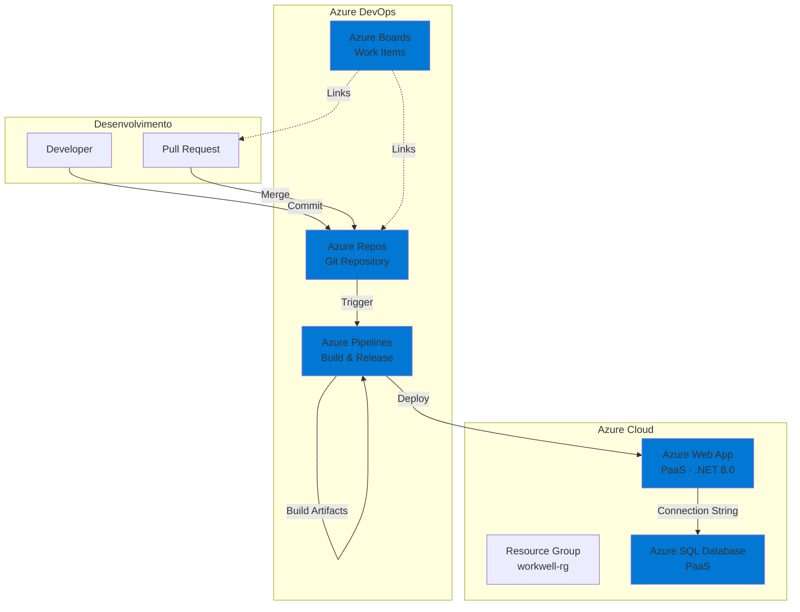

# WorkWell API - Plataforma de Bem-Estar Corporativo

## 📋 Sobre o Projeto

WorkWell é uma API .NET 8.0 desenvolvida para gerenciar o bem-estar emocional e psicológico de funcionários em empresas. A plataforma oferece funcionalidades como avaliações emocionais, consultas psicológicas, atividades de bem-estar, enquetes, denúncias anônimas e indicadores de saúde mental organizacional.

## 🏗️ Arquitetura

### Diagrama Macro da Arquitetura



### Fluxo de CI/CD

1. **Desenvolvimento**: Developer faz commit e cria Pull Request
2. **Azure Boards**: Work Item vinculado ao PR
3. **Azure Repos**: Branch protegida com revisor obrigatório
4. **Azure Pipelines - Build**: 
   - Executa após merge do PR
   - Restore, Build, Testes (XUnit)
   - Publica artefatos e resultados de testes
5. **Azure Pipelines - Release**:
   - Executa automaticamente após Build
   - Deploy para Azure Web App (PaaS)
   - Configura App Settings
   - Aplica EF Core Migrations

## 🚀 Tecnologias

- **.NET 8.0** - Framework principal
- **Entity Framework Core** - ORM
- **Azure SQL Database** - Banco de dados (PaaS)
- **Azure Web App** - Hospedagem (PaaS)
- **XUnit** - Framework de testes
- **Swagger/OpenAPI** - Documentação da API
- **Azure DevOps** - CI/CD e gerenciamento

## 📦 Estrutura do Projeto

```
WorkWell.sln
├── WorkWell.API/              # Camada de apresentação (Controllers, Middleware)
├── WorkWell.Application/      # Camada de aplicação (Services, DTOs)
├── WorkWell.Domain/           # Camada de domínio (Entities, Interfaces)
├── WorkWell.Infrastructure/   # Camada de infraestrutura (Repositories, DbContext)
├── WorkWell.Tests/            # Testes unitários (XUnit)
├── scripts/                   # Scripts de infraestrutura e banco
│   ├── script-infra-deploy.sh
│   └── script-bd.sql
├── azure-pipeline-build.yml   # Pipeline de Build
└── azure-pipeline-release.yml # Pipeline de Release
```

## 🔐 Autenticação

A API utiliza **API Keys** para autenticação. Cada perfil possui uma chave específica:

- **Admin**: Acesso total ao sistema
- **RH**: Gestão de funcionários e setores
- **Psicologo**: Acesso a consultas e avaliações
- **Funcionario**: Acesso limitado ao próprio perfil

### Headers Obrigatórios

```
X-API-Key: <sua-api-key>
```

## 📚 Endpoints CRUD - Exemplos JSON

### 1. Empresa (EmpresaController)

#### CREATE - POST `/api/v1/Empresa`

**Request:**
```json
{
  "nome": "Futuro do Trabalho Ltda",
  "emailAdmin": "admin@futurework.com",
  "senhaAdmin": "admin123",
  "tokenAcesso": "token-ftw-001",
  "logoUrl": "https://futurework.com/logo.png",
  "corPrimaria": "#1F77B4",
  "corSecundaria": "#FFB800",
  "missao": "Transformar o bem-estar no ambiente de trabalho.",
  "politicaBemEstar": "Aqui o respeito e o cuidado são prioridades!"
}
```

**Response (201 Created):**
```json
{
  "id": 1,
  "nome": "Futuro do Trabalho Ltda",
  "emailAdmin": "admin@futurework.com",
  "senhaAdmin": "admin123",
  "tokenAcesso": "token-ftw-001",
  "logoUrl": "https://futurework.com/logo.png",
  "corPrimaria": "#1F77B4",
  "corSecundaria": "#FFB800",
  "missao": "Transformar o bem-estar no ambiente de trabalho.",
  "politicaBemEstar": "Aqui o respeito e o cuidado são prioridades!"
}
```

#### READ - GET `/api/v1/Empresa/{id}`

**Response (200 OK):**
```json
{
  "id": 1,
  "nome": "Futuro do Trabalho Ltda",
  "emailAdmin": "admin@futurework.com",
  "senhaAdmin": "admin123",
  "tokenAcesso": "token-ftw-001",
  "logoUrl": "https://futurework.com/logo.png",
  "corPrimaria": "#1F77B4",
  "corSecundaria": "#FFB800",
  "missao": "Transformar o bem-estar no ambiente de trabalho.",
  "politicaBemEstar": "Aqui o respeito e o cuidado são prioridades!"
}
```

#### READ ALL (Paged) - GET `/api/v1/Empresa?page=1&pageSize=10`

**Response (200 OK):**
```json
{
  "page": 1,
  "pageSize": 10,
  "totalCount": 1,
  "totalPages": 1,
  "data": [
    {
      "id": 1,
      "nome": "Futuro do Trabalho Ltda",
      "emailAdmin": "admin@futurework.com",
      "senhaAdmin": "admin123",
      "tokenAcesso": "token-ftw-001",
      "logoUrl": "https://futurework.com/logo.png",
      "corPrimaria": "#1F77B4",
      "corSecundaria": "#FFB800",
      "missao": "Transformar o bem-estar no ambiente de trabalho.",
      "politicaBemEstar": "Aqui o respeito e o cuidado são prioridades!"
    }
  ],
  "links": {
    "self": "/api/v1/Empresa?page=1&pageSize=10",
    "first": "/api/v1/Empresa?page=1&pageSize=10",
    "last": "/api/v1/Empresa?page=1&pageSize=10"
  }
}
```

#### UPDATE - PUT `/api/v1/Empresa/{id}`

**Request:**
```json
{
  "id": 1,
  "nome": "Futuro do Trabalho Ltda - Atualizado",
  "emailAdmin": "admin@futurework.com",
  "senhaAdmin": "admin123",
  "tokenAcesso": "token-ftw-001",
  "logoUrl": "https://futurework.com/logo-v2.png",
  "corPrimaria": "#1F77B4",
  "corSecundaria": "#FFB800",
  "missao": "Transformar o bem-estar no ambiente de trabalho - Missão Atualizada.",
  "politicaBemEstar": "Aqui o respeito e o cuidado são prioridades!"
}
```

**Response (204 No Content)**

#### DELETE - DELETE `/api/v1/Empresa/{id}`

**Response (204 No Content)**

---

### 2. Funcionario (FuncionarioController)

#### CREATE - POST `/api/v1/Funcionario`

**Request:**
```json
{
  "nome": "Carlos Silva",
  "email": "carlos@futurework.com",
  "senha": "func123",
  "tokenEmpresa": "token-ftw-001",
  "cargo": 2,
  "ativo": true,
  "setorId": 1
}
```

**Nota:** `cargo` é um enum:
- `0` = Admin
- `1` = RH
- `2` = Funcionario
- `3` = Psicologo

**Response (201 Created):**
```json
{
  "id": 1,
  "nome": "Carlos Silva",
  "email": "carlos@futurework.com",
  "senha": "func123",
  "tokenEmpresa": "token-ftw-001",
  "cargo": 2,
  "ativo": true,
  "setorId": 1
}
```

#### READ - GET `/api/v1/Funcionario/{id}`

**Response (200 OK):**
```json
{
  "id": 1,
  "nome": "Carlos Silva",
  "email": "carlos@futurework.com",
  "senha": "func123",
  "tokenEmpresa": "token-ftw-001",
  "cargo": 2,
  "ativo": true,
  "setorId": 1
}
```

#### READ ALL (Paged) - GET `/api/v1/Funcionario?page=1&pageSize=10`

**Response (200 OK):**
```json
{
  "page": 1,
  "pageSize": 10,
  "totalCount": 1,
  "totalPages": 1,
  "data": [
    {
      "id": 1,
      "nome": "Carlos Silva",
      "email": "carlos@futurework.com",
      "senha": "func123",
      "tokenEmpresa": "token-ftw-001",
      "cargo": 2,
      "ativo": true,
      "setorId": 1
    }
  ],
  "links": {
    "self": "/api/v1/Funcionario?page=1&pageSize=10",
    "first": "/api/v1/Funcionario?page=1&pageSize=10",
    "last": "/api/v1/Funcionario?page=1&pageSize=10"
  }
}
```

#### UPDATE - PUT `/api/v1/Funcionario/{id}`

**Request:**
```json
{
  "id": 1,
  "nome": "Carlos Silva Santos",
  "email": "carlos.santos@futurework.com",
  "senha": "func123",
  "tokenEmpresa": "token-ftw-001",
  "cargo": 2,
  "ativo": true,
  "setorId": 1
}
```

**Response (204 No Content)**

#### DELETE - DELETE `/api/v1/Funcionario/{id}`

**Response (204 No Content)**

---

## 🛠️ Configuração e Deploy

### Pré-requisitos

- Azure CLI instalado e configurado
- Conta Azure com permissões para criar recursos
- Azure DevOps configurado

### 1. Provisionamento de Infraestrutura

Execute o script de provisionamento:

```bash
chmod +x scripts/script-infra-deploy.sh
./scripts/script-infra-deploy.sh
```

O script cria:
- Resource Group
- Azure SQL Server e Database
- App Service Plan
- Azure Web App (PaaS)

### 2. Configuração do Azure DevOps

#### Variáveis Secretas

Configure as seguintes variáveis no Azure DevOps (Library → Variable Groups):

- `SQL_PASSWORD` (Secret)
- `APIKEY_ADMIN` (Secret)
- `APIKEY_RH` (Secret)
- `APIKEY_PSICOLOGO` (Secret)
- `APIKEY_FUNCIONARIO` (Secret)
- `SUPERAPIKEY` (Secret)

#### Service Connection

Crie uma Service Connection do tipo "Azure Resource Manager" com o nome:
- `workwell-azure-subscription`

#### Branch Policies

Configure a branch `main` como protegida:
- Revisor obrigatório
- Vinculação de Work Item obrigatória
- Revisor padrão (seu RM)

### 3. Pipelines

#### Build Pipeline

1. Crie uma nova pipeline no Azure DevOps
2. Selecione "Azure Repos Git"
3. Escolha o arquivo `azure-pipeline-build.yml`
4. Nomeie como: `WorkWell API - Build`

#### Release Pipeline

1. Crie uma nova pipeline no Azure DevOps
2. Selecione "Azure Repos Git"
3. Escolha o arquivo `azure-pipeline-release.yml`
4. Nomeie como: `WorkWell API - Release`
5. Configure a dependência do Build Pipeline

## 🧪 Testes

Os testes são executados automaticamente na pipeline de Build usando XUnit.

Para executar localmente:

```bash
dotnet test WorkWell.Tests/WorkWell.Tests.csproj
```

## 📊 Health Check

A API expõe um endpoint de health check:

```
GET /health
```

## 📝 Documentação da API

A documentação Swagger está disponível em:

```
https://<webapp-name>.azurewebsites.net/swagger
```

## 🔒 Segurança

- API Keys protegidas como variáveis secretas no Azure DevOps
- Connection Strings não expostas no código
- Firewall do Azure SQL configurado
- HTTPS habilitado no Azure Web App

## 📄 Licença

Este projeto foi desenvolvido para fins acadêmicos.

## 👥 Autores

Desenvolvido como parte da disciplina Advanced Business Development with .NET.
